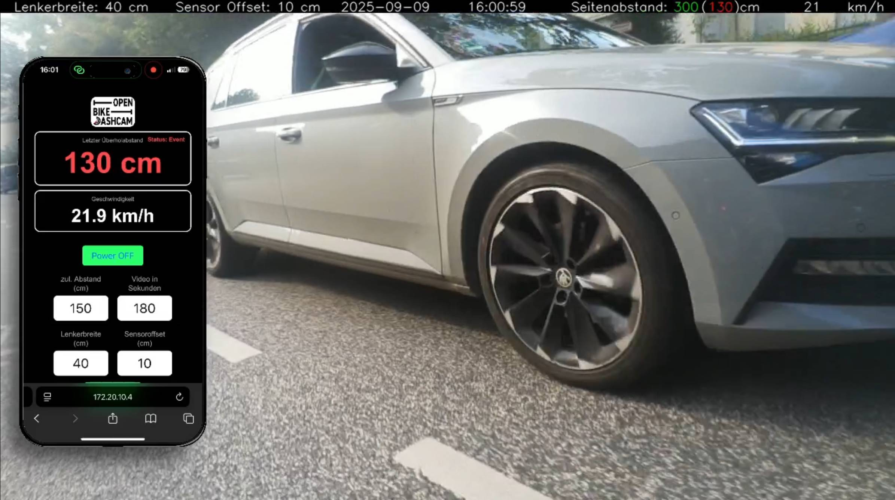

----- Das ist die erste, veröffentlichte Version der Dashcam. Sie enthält noch ein paar Bugs und Verbesserungsmöglichkeiten, die demnächst bearbeitet werden ---------  

# OpenBikeDashcam - Kurzbeschreibung

 

Das Projekt besteht aus einer Dashcam fürs Fahrrad, die Videos des rückwärtigen und seitlichen Verkehrs aufnimmt. Zusätzlich wird mit einem Abstandssensor der Überholabstand der vorbeifahrenden Autos ermittelt und im Video angezeigt. Folgende Funktionen sind bereits integriert: 

- Videoaufnahme in Sequenzen von einstellbarer Länge (z.B. 30Sekunden)  
- Speicherung auf USB Stick nur, wenn während der Aufnahmezeit eines Segmentes der Sicherheitsabstand unterschritten wurde. sonst wird das Segment gelöscht.  
- Einstellungen von zulässigem Abstand, Lenkerbreite, Länge der Videosequenzen, Versatz des Sensors von der Fahrradmitte ist über txt Dateien auf dem USB stick oder über die WebApp mögich
- Sollten auf dem USB Stick weniger als 100mb Speicherplatz verbleiben, wird das letzte Video gelöscht (Status LED zeigt das durch blau farbe an)
- Zu jedem Video wird eine CSV Datei mit GPS Daten, Zeit und Abstand gespeichert.

# Ausblick: demnächst verfügbare Funktionen  
- weitere Fahrradcomputer-Funktionen in der WebApp (Max-Geschwindigkeit, Durchschnittsgeschwindigkeit, Fahrzeit, Fahrstecke in km. Alles seit dem letzten Programmstart und seit Inbetriebnahme der Dashcam)
- ..

# Lizenz
Software: GNU GENERAL PUBLIC LICENSE Version 3, 29 June 2007
Hardware: CERN Open Hardware Licence Version 2 - Strongly Reciprocal

